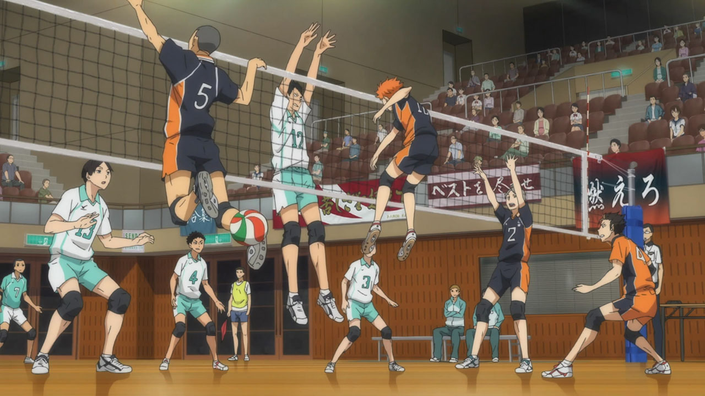

# Kevin Wong
## *Computer Science Student @ UC San Diego*
> Eager to have fun and learn :)

#### Connect With Me!
[GitHub](https://github.com/kduby)  [LinkedIn](https://www.linkedin.com/in/kevinwong01/)    [Email](kew005@ucsd.edu)  

###### Skills
-C/C++
-Java
-Python
-React
-HTML/CSS
-Javascript
-Typescript

###### Goals
- [x] Exercise daily
- [] Learn something entirely new
- [] Sleep early, wake up early
- [] Practice coding problems

###### Interests
- Sports 
 1. volleyball
 2. basketball
 3. swimming
 4. running

- TV Shows 
- Music

- Games

[Currently working on](current.md)
